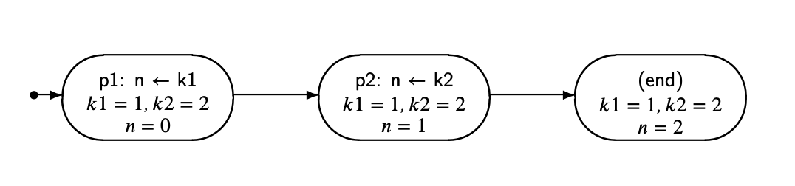
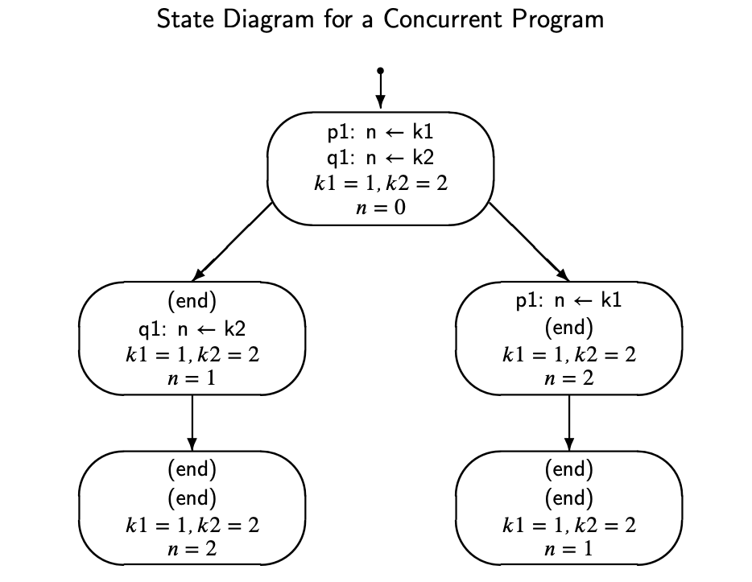

# Programación vs Concurrencia
Ordenes que han sido escritas desde ell inicio al fina
EN la secuencial Concurrente es un Proceso que ejecuta cada una de las tareas.
Concurrencia es un pseudo paralelismo.

## Diagrama Sequencial
Cada acción se ejecuta sequencialmente y no varía el resultado.

## Diagrama Concurrente
Dependiendo de las lineas de código se puede determinar cuantos caminos se generan.
